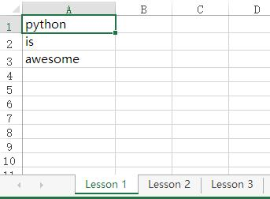
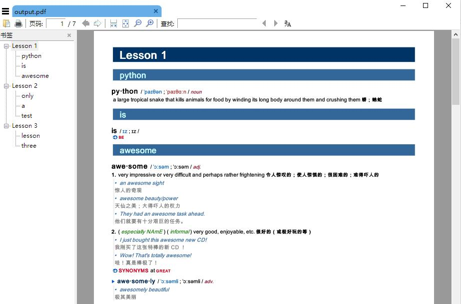

这是一个用来从 mdx 字典中抓取所需的单词，并生成 html，pdf 或 jpg 文件的小工具。

## 用法
    usage: MdxConverter.py [-h] [--type [{pdf,html,jpg}]] [--invalid {0,1,2}] mdx_name input_name [output_name]

    positional arguments:
    mdx_name
    input_name
    output_name

    optional arguments:
    -h, --help            show this help message and exit
    --type [{pdf,html,jpg}]
    --invalid {0,1,2}     action for meeting invalid words
                            0: exit immediately
                            1: output warnning message to pdf/html
                            2: collect them to invalid_words.txt (default)

例如：
    
    MdxConverter 某某词典.mdx input.xlsx output.pdf

## 依赖库
[mdict-query](https://github.com/mmjang/mdict-query)

[BeautifulSoup4](https://pypi.org/project/beautifulsoup4)

[openpyxl](https://pypi.org/project/openpyxl)

[pdfkit](https://github.com/JazzCore/python-pdfkit)

[imgkit](https://github.com/jarrekk/imgkit)

[lxml](https://lxml.de)

[chardet](https://github.com/chardet/chardet)

## 输入
### txt 示例
    #Lesson 1
    hello
    world

    #Lesson 2
    python
    is
    awesome


### json 示例
```javascript
 [
 {
     "name": "Lesson 1",
     "words": [
         "hello",
         "world"
     ]
 },
 {
     "name": "Lesson 2",
     "words": [
         "python",
         "is",
         "awesome"
     ]
 }
 ]
```

### excel 示例


## 输出
### HTML


### PDF


### JPG
略